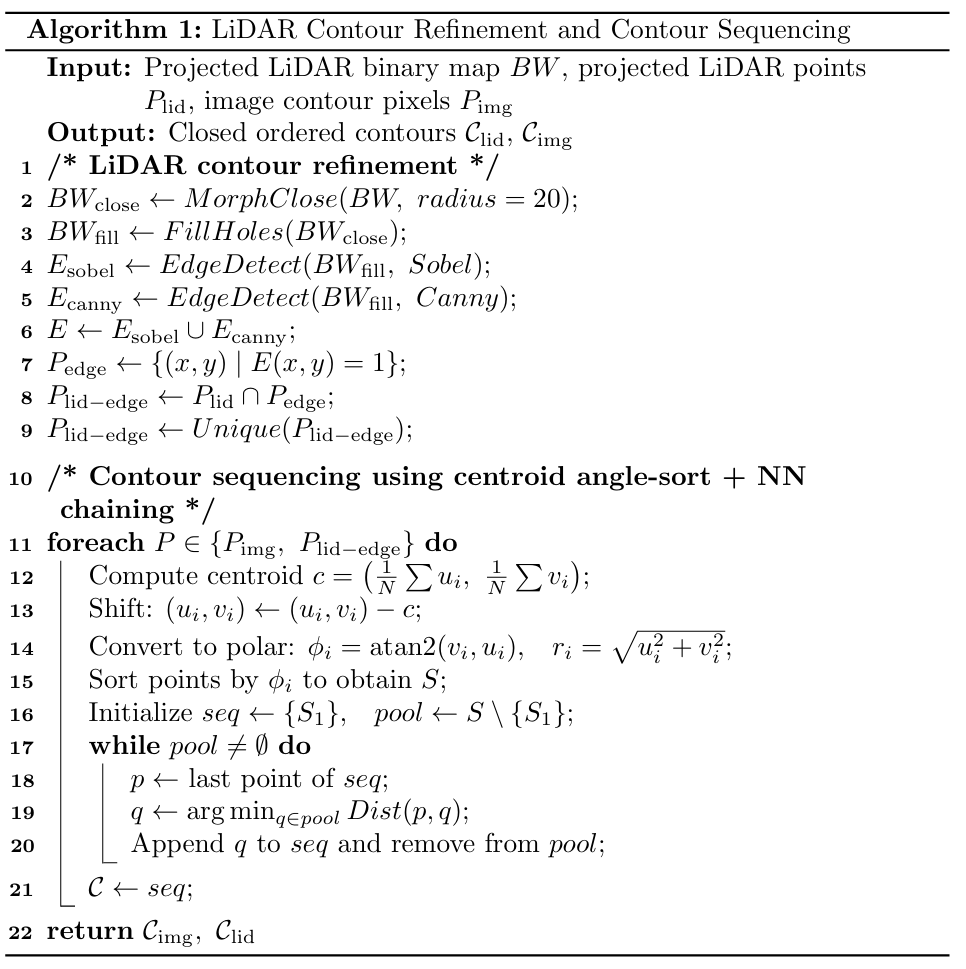
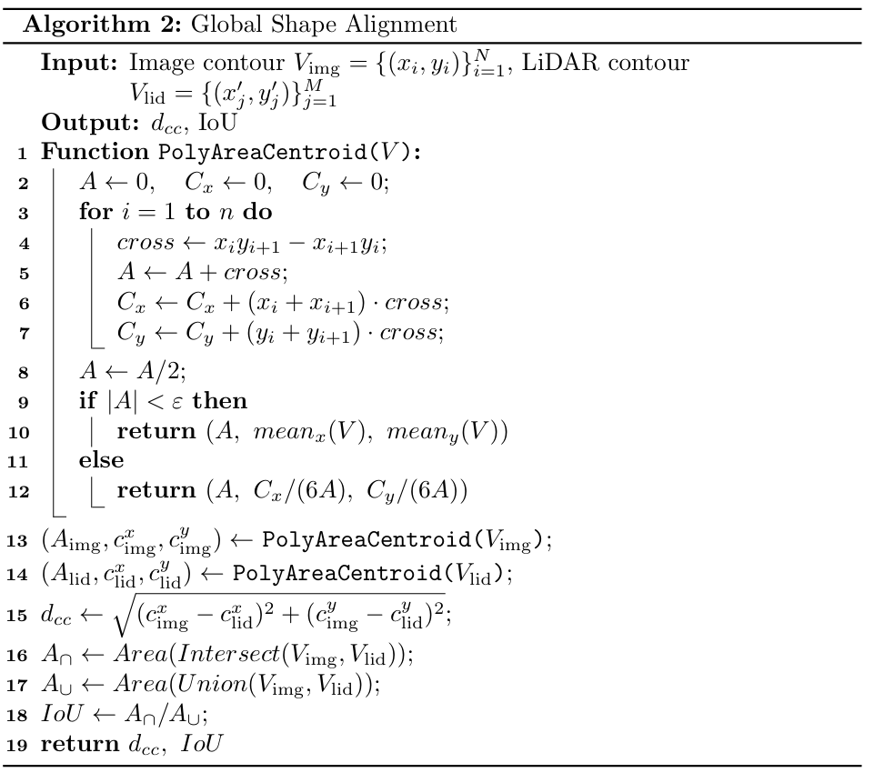
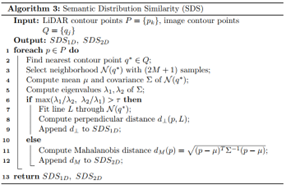

# CASA-Calib (Paper with Code)
CASA-Calib: A Context-Aware Semantic Alignment Method for LiDAR-Camera Extrinsic Calibration for Vehicle Perception Systems

> **Note:** This repository is currently being actively updated.  
> Components related to dataset construction, visualization tooling, and CASA-Calib modules  
> are under continuous refinement. Additional documentation and examples will be released soon.

📌 Visualization Example


Left — IoU-based Alignment View: three different centroid definitions are visualized to illustrate the effect of LiDAR contour refinement

- Red region — Refined LiDAR semantic contour mask (after our proposed contour refinement).

- Blue region — Pixel-based semantic mask from the image.

- Blue centroid — The centroid of the pixel-based semantic mask obtained from the image.

- Green centroid — The centroid computed from the refined LiDAR semantic contour, which is our proposed centroid estimation method based on contour refinement.

- Yellow centroid — The centroid computed from the raw (unrefined) LiDAR semantic contour, which follows the conventional centroid estimation strategy commonly used in prior works.

From the visualization, it can be observed that the green centroid is significantly closer to the image semantic centroid (blue) compared to the yellow centroid. This indicates that, after LiDAR contour refinement, the semantic centroid estimated from LiDAR becomes more consistent with the image-based semantic centroid.

This improvement effectively mitigates the inherent limitations of LiDAR sensing, including point cloud sparsity, material-dependent penetration effects (e.g., vehicle windows), and lower spatial resolution compared to cameras, all of which tend to bias the centroid computed from raw LiDAR contours and enlarge the discrepancy with image-based centroids.

Right — Final Contour Overlay

- Red contour — Image-derived semantic contour.

- Yellow contour — Refined LiDAR semantic contour.

- Green points — Refined LiDAR contour vertices.


Author: Yuan-Ting Fu

This repository provides the official MATLAB implementation of the core components used in the CASA-Calib paper, including:

CASA-Loss (full loss formulation used during calibration)

Cost landscape visualization (Fig. 7)

Tau sensitivity analysis (Fig. 4)

Perturbation robustness experiments (Fig. 5)

All scripts are self-contained and assume you have already prepared the curated Waymo dataset described in the paper.

```text
CASA_Calib/
│
├── CASA_Loss.m                    # Core CASA-Loss (Section III of paper)
│
├── cost_landscape.m               # J(Δty, Δtz) landscape → Fig. 7
│
├── Tau_Sensitivity_Analysis.m     # Tau sweep & stability band → Fig. 4
│
├── perturbation_analysis.m        # Perturbation robustness → Fig. 5
│
├── img_contour_seq_fast.m         # Contour sequencing (used by CASA-Loss)
├── LiDAR_contour_extraction_opt.m # LiDAR contour extraction
├── loss_proj.m                    # Local SDS similarity (1D/2D)
├── loss_shape_optimized.m         # IoU, centroid consistency (global terms)
│
└── README.md                      # This file
```

🎯 How to Reproduce Figures in the Paper
1. Figure 4 — Tau Sensitivit
Run:
Tau_Sensitivity_Analysis

Outputs:
Tau sweep (% improvement)
Pareto plot
Distance-to-ideal score + 2% stability band
Matches Fig. 4(a) and Fig. 4(b).

2. Figure 5 — Perturbation Robustness

Run:
perturbation_analysis

Choose:
Rotation-only
Translation-only
Rotation + translation (default)

Outputs:
average rotation error vs perturbation
average translation error vs perturbation
optional: loss / keep-ratio visualization
Reproduces Fig. 5(a)(b).

3. Figure 7 — Cost Landscape (2D + 3D)
Run:
cost_landscape

The script computes the multi-frame CASA cost around ground-truth:
3D surface of J(Δty, Δtz)
2D contour + metrics (d*, FWHM, Aε)
Reproduces Fig. 7.

4. CASA-Loss (Core Loss Function)

CASA_Loss.m implements the exact formulation in Section III:

| Term                          | Description                             |
| ----------------------------- | --------------------------------------- |
| **IoU similarity**            | Global shape alignment                  |
| **Centroid consistency (CC)** | Penalizes shifts between contours       |
| **SDS-1D**                    | Line-like local distribution similarity |
| **SDS-2D**                    | Area-like local distribution similarity |
| **α coupling**                | IoU-guided weighting                    |

This function is used by all optimization scripts.

🔗 Function Dependency Graph
```text
CASA_Loss
 ├── img_contour_seq_fast
 ├── LiDAR_contour_extraction_opt
 ├── loss_proj
 └── loss_shape_optimized

perturbation_analysis
 └── CASA_Loss

cost_landscape
 └── CASA_Loss
```

Semantic–Geometric Dataset Builder

Contribution III — Semantic–Geometric Test Set Construction

This repository includes a custom data extraction tool that constructs a curated semantic–geometric test set derived from the Waymo Open Dataset, as described in Contribution 3 of our paper:


“We construct and release a curated semantic–geometric test set based on the Waymo Open Dataset, providing reliable instance-level correspondences for accurate evaluation and benchmarking of semantic-assisted LiDAR–camera calibration methods.”


Unlike standard datasets—where


LiDAR instance IDs and image instance IDs do not correspond,


camera–LiDAR associations must be manually aligned, and


segmentation labels may contain annotation errors,


our tool automatically aligns per-instance LiDAR and camera semantic labels, and exports a cleaned, structured dataset suitable for semantic-assisted calibration research (e.g., CASA-Calib).

🛠 Semantic–Geometric Dataset Builder
File: waymo_semantic_geometric_builder.py

This script processes raw .tfrecord files from the Waymo Open Dataset and generates a pairwise-consistent LiDAR–camera dataset with:

✔ Reliable instance-level correspondences

✔ Pixel-level image segmentation masks

✔ LiDAR point-level semantic & instance labels

✔ Synchronized calibration matrices

✔ A directory structure compatible with CASA-Calib


📦 Output Directory Structure

After running the tool, each valid frame will be exported as:

```text
waymo_segment_data/
 └── <sequence_id>/
      └── <tfrecord_name>/
           └── <frame_id>/
                ├── calib.txt                 # KITTI-style camera–LiDAR extrinsic
                ├── img_raw.png               # RGB image
                ├── panoptic_label_front.png  # image segmentation (uint16)
                ├── instance_label_front.png  # instance map (uint16)
                ├── instance_waymo.png        # original Waymo instance ID map
                ├── points_all.txt            # LiDAR XYZ points (all beams)
                ├── point_labels_all.txt      # corresponding semantic/instance IDs
                ├── lidar.bin                 # binary point cloud file (float32)
                └── ... (additional metadata)
```

This format is fully compatible with CASA-Calib, and can also be used for:

1.Semantic calibration

2.Instance-matching research

3.LiDAR-camera fusion

4.3D instance segmentation training

📦 Description for Semantic–Geometric Dataset Builder
*A core component for constructing the CASA-Calib semantic–geometric evaluation dataset.*

This repository includes a dedicated extraction tool to convert raw Waymo Open Dataset
`.tfrecord` files into a curated semantic–geometric dataset.  
This dataset is required for evaluating instance-level LiDAR–camera calibration methods
and corresponds to **Contribution 3** of the CASA-Calib paper.

### ✨ Purpose  
Waymo provides high-quality but **independently generated** camera and LiDAR segmentation
annotations. CASA-Calib requires a dataset in which:

- semantic labels from *both* modalities are consistently extracted  
- LiDAR segmentation is converted into per-point labels  
- camera instance masks can be paired with LiDAR object clusters  
- each frame contains complete segmentation annotations  
- manual (or automatic) LiDAR–image instance correspondence can be established  

This extractor performs all the above and exports a clean, structured dataset suitable
for downstream calibration evaluation.

---

## Features of the Extractor  
- Extracts RGB images, panoptic labels, semantic labels, and instance masks  
- Converts Waymo’s LiDAR range-image segmentation into **3D point-level labels**  
- Saves LiDAR point clouds (`lidar.bin`), semantic labels, and projection information  
- Exports KITTI-style calibration matrices (`calib.txt`)  
- Filters invalid frames lacking segmentation labels  
- Provides a **Qt-based GUI** for interactive LiDAR–image instance matching  
- GUI buttons: **Save Match**, **Clear Selection**, **Skip Frame**, **Reset View**  
- Produces a CSV summary listing all matched instances per sequence  

## Matching GUI Overview

CASA-Calib includes an interactive Qt-based GUI for establishing instance-level
correspondences between camera segmentation masks and LiDAR point clusters.
This tool is essential for validating semantic–geometric consistency and for
constructing high-quality benchmark data.

The interface consists of four synchronized visualizations:

1. **Image Instance Label (Top-Left)**  
   Displays the instance-level segmentation mask from the camera.  
   Each instance is assigned a unique color and labeled with its instance ID.

2. **LiDAR BEV Projection — Top Instances (Top-Right)**  
   Shows the most prominent LiDAR object clusters in Bird’s-Eye-View (BEV).  
   Each cluster (instance ID) is color-coded consistently across subplots.

3. **All LiDAR Points Projected to the Image (Bottom-Left)**  
   Projects every LiDAR point into the camera frame, colored by depth (m).  
   This allows users to inspect geometric alignment and calibration consistency.

4. **Semantic Point Cloud Projection (Bottom-Right)**  
   Projects only semantically valid LiDAR points and colors them by instance ID.
   This view highlights object-level alignment between modalities.

### GUI Interaction

The interface supports the following actions:

| Button | Function |
|--------|----------|
| **Clear Selection** | Removes all selected pixel and LiDAR selections |
| **Save Match** | Stores the current pixel ↔ LiDAR instance correspondence |
| **Skip Frame** | Discards the current frame and removes temporary output |
| **Reset View** | Resets zoom and panning for all subplots |

### Example Screenshots

Below are example GUI screenshots captured during matching:

#### Image Instance Label + LiDAR BEV Projection
   


#### Pixel Selection + LiDAR Cluster Highlighting


#### Final Instance Projection and Correspondence Visualization


## 📘 Algorithms Presented in the Paper

The CASA-Calib paper provides three algorithms that summarize the main
computational stages of the proposed contour-based semantic–geometric
alignment framework.

These algorithms cover:

1. contour refinement and ordered contour construction;
2. global shape alignment using centroid consistency and region overlap; and
3. local semantic distribution similarity using adaptive 1D/2D neighborhood modeling.

The corresponding MATLAB implementations are included in this repository.

### Paper-to-Code Mapping

| Paper Algorithm | Main Purpose | MATLAB Implementation |
|---|---|---|
| **Algorithm 1** | LiDAR contour refinement and contour sequencing | `LiDAR_contour_extraction_opt.m`, `img_contour_seq_fast.m` |
| **Algorithm 2** | Global shape alignment using centroid distance and IoU | `loss_shape_optimized.m` |
| **Algorithm 3** | Local semantic distribution similarity (SDS-1D/SDS-2D) | `loss_proj.m` |

---

### Algorithm 1 — LiDAR Contour Refinement and Contour Sequencing

Algorithm 1 converts the image semantic boundary and projected LiDAR points
into ordered contour sequences that can be consistently compared across the
two sensing modalities.

The projected LiDAR points are first rasterized into a binary image. Because
raw LiDAR projections are usually sparse and discontinuous, morphological
closing and hole filling are applied to construct a more continuous support
region. Sobel and Canny edge detectors are then combined to identify candidate
boundary pixels. Only projected LiDAR samples located on the fused edge map
are retained, and duplicate samples are removed.

After contour extraction, both the image contour and the refined LiDAR contour
are converted into ordered sequences. Each contour point is represented using
its image coordinate and its polar coordinate relative to the contour centroid.
An initial angular ordering is followed by nearest-neighbor chaining to reduce
local discontinuities caused by sparse or unevenly distributed boundary
samples.

**Inputs**

- projected LiDAR binary map;
- projected LiDAR image-plane points;
- image semantic contour pixels.

**Outputs**

- ordered image contour sequence, `C_img`;
- ordered LiDAR contour sequence, `C_lid`.

**Implementation**

- `LiDAR_contour_extraction_opt.m` performs LiDAR contour refinement;
- `img_contour_seq_fast.m` constructs the ordered contour sequences.

The resulting contours provide the common structural representation used by
both the global and local alignment modules.

<!-- Optional pseudocode figure -->


---

### Algorithm 2 — Global Shape Alignment

Algorithm 2 evaluates coarse, object-level agreement between the image and
LiDAR contours.

The two ordered contours are converted into closed polygonal regions. Their
areas and polygon centroids are computed, and the global alignment is described
using two complementary measurements:

- **Centroid consistency (`d_CC`)** measures the Euclidean distance between
  the image-contour centroid and the LiDAR-contour centroid.
- **Intersection-over-Union (`IoU`)** measures the overlap between the two
  enclosed polygonal regions.

Centroid consistency provides a stable positional constraint, while IoU
captures the overall agreement in object location, scale, and shape. Together,
they form the global shape-alignment component of CASA-Loss.

**Inputs**

- ordered image contour vertices, `V_img`;
- ordered LiDAR contour vertices, `V_lid`.

**Outputs**

- centroid distance, `d_CC`;
- contour-region overlap, `IoU`.

**Implementation**

- `loss_shape_optimized.m`

<!-- Optional pseudocode figure -->


---

### Algorithm 3 — Semantic Distribution Similarity (SDS)

Algorithm 3 evaluates fine-grained local consistency between the projected
LiDAR contour and the image semantic contour.

For each LiDAR contour point, the nearest image-contour point is identified.
A local neighborhood around this matched image point is then selected from the
ordered image contour. The covariance matrix of the neighborhood is computed,
and its eigenvalue ratio is used to determine the local geometric structure.

Two types of local distributions are considered:

- **SDS-1D:**  
  Highly anisotropic neighborhoods are treated as line-like structures.
  A local line is fitted to the image-contour neighborhood, and the
  perpendicular distance from the LiDAR point to this line is measured.

- **SDS-2D:**  
  Near-isotropic neighborhoods are treated as two-dimensional elliptical
  regions. The Mahalanobis distance between the LiDAR point and the local
  image-contour distribution is measured.

This adaptive classification allows SDS to model both elongated vehicle
boundaries, such as rooflines and side edges, and compact structures, such as
wheels, mirrors, and bumper regions.

**Inputs**

- ordered LiDAR contour points;
- ordered image contour points.

**Outputs**

- pointwise line-like distribution distances, `SDS_1D`;
- pointwise elliptical distribution distances, `SDS_2D`.

The raw distances are subsequently converted into normalized similarity scores
and incorporated into CASA-Loss through the IoU-guided coupling mechanism.

**Implementation**

- `loss_proj.m`

<!-- Optional pseudocode figure -->
 

---

### Relationship Between the Three Algorithms

The three algorithms form a sequential contour-level alignment pipeline:

```text
Projected LiDAR Points + Image Semantic Mask
                    │
                    ▼
Algorithm 1: Contour Refinement and Sequencing
                    │
          ┌─────────┴─────────┐
          ▼                   ▼
Algorithm 2              Algorithm 3
Global Shape             Local Semantic
Alignment                Distribution Similarity
(IoU and d_CC)           (SDS-1D and SDS-2D)
          └─────────┬─────────┘
                    ▼
          IoU-Guided CASA-Loss
                    │
                    ▼
       LiDAR–Camera Extrinsic Optimization
   

📩 Questions / Issues

If you encounter missing files, dataset format questions, or need help adapting the code, feel free to open a GitHub issue or contact the author.

